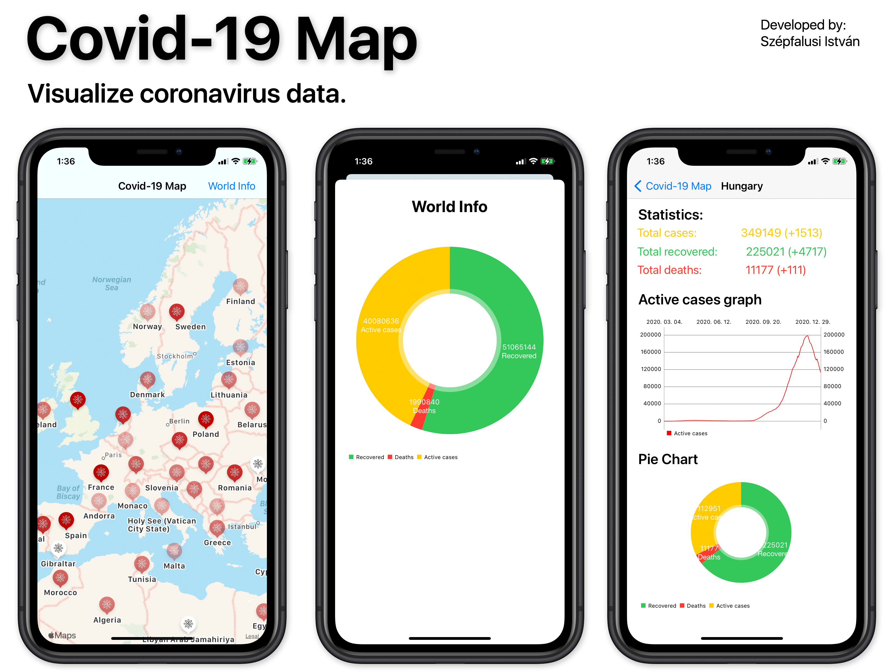

# **Covid-19-Map**

Covid-19-Map egy iOS-en futó alkalmazás, mely API-ból lekért adatokat vizualizálja egy térképen, és országokra kattintva, bővebb információkat lehet megtudni, grafikonokkal, esetszámokkal.

## App működése

Az app indulásakor egy térkép jelenik meg amelyen, színnel jelezve látszódnak az országok, mennyire vannak fertőzödve.
Jobb felső sarokban a World Info gomb egy tortadiagrammon mutatja az aktuális adatokat világra vonatkozóan

Az országok esetszámait kilistázza adat formában, ezután egy idővonalon láthatjuk, hogy alakult az aktív esetszám az országban az első koronavírus fertőzött óta.
A tortadiagrammon továbbá láthatjuk milyen arányban vannak az esetek.

## **Felhasznált API, library-k**

**API:** [Covid19API](https://covid19api.com/)

**Diagramok**: [Charts](https://github.com/danielgindi/Charts)

## **Szerző**

**Fejlesztette:** Szépfalusi István  

